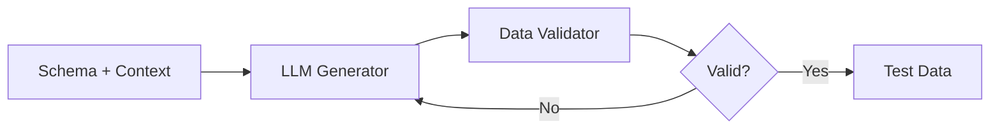

# agent-test-data-smith

[](https://github.com/Jai-Gogineni/agent-test-data-smith/actions)
[](LICENSE)
[](https://www.typescriptlang.org/)

Test data generation agent that creates realistic e-commerce data (orders, payments, refunds, users) using context-aware LLM prompting. Designed for commerce and payment system testing.

## How It Works



## Quick Start

```bash
git clone https://github.com/Jai-Gogineni/agent-test-data-smith.git
cd agent-test-data-smith
npm install
cp .env.example .env  # Add your API keys
npm run build
```

## Configuration

| Variable | Required | Description |
|----------|----------|-------------|
| `ANTHROPIC_API_KEY` | Yes | For intelligent data generation |
| `BRAND_CONTEXT` | No | Brand name for domain-specific data |

## Example Usage

```typescript
import { TestDataSmithAgent } from "./src/agent";

const smith = new TestDataSmithAgent(process.env.ANTHROPIC_API_KEY!);
const orders = await smith.generateOrders(10, "luxury-beauty");
// Returns realistic orders with SKUs, quantities, promotions, totals
console.log(orders[0]);
```

## Architecture

Built with TypeScript for type safety, uses the Anthropic SDK for LLM capabilities, and follows a single-responsibility pattern where each agent has one clear job. Designed to be composable — agents can be chained together for complex workflows.

## Contributing

See [CONTRIBUTING.md](CONTRIBUTING.md) for guidelines.

## Author

**Jai Gogineni** — [jaigogineni.com](https://jaigogineni.com) · [LinkedIn](https://uk.linkedin.com/in/jai-gogineni-9a396654)
