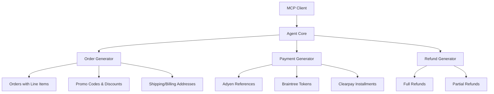

# agent-test-data-smith

[](https://github.com/Jai-Gogineni/agent-test-data-smith/actions/workflows/ci.yml)
[](https://opensource.org/licenses/MIT)
[](https://www.typescriptlang.org/)
[](https://modelcontextprotocol.io)

> Test data smith — AI-generated realistic commerce test data

## Architecture



## Quick Start

```bash
# Clone the repository
git clone https://github.com/Jai-Gogineni/agent-test-data-smith.git
cd agent-test-data-smith

# Install dependencies
npm install

# Build
npm run build
```

## Project Structure

```
src/
├── agent.ts                        # MCP server entry point
└── generators/
    ├── order-generator.ts          # Orders with line items, promos, addresses
    ├── payment-generator.ts        # Adyen/Braintree/Clearpay payment refs
    └── refund-generator.ts         # Partial/full refund records
```

## MCP Tools

| Tool | Description |
|------|-------------|
| `generate_order` | Generate realistic e-commerce orders with line items and promos |
| `generate_payment` | Generate payment references for Adyen/Braintree/Clearpay |
| `generate_refund` | Generate partial or full refund test data |

## Supported Providers

- **Adyen** — PSP references, merchant accounts, iDEAL/Klarna methods
- **Braintree** — GraphQL tokens, PayPal/Venmo/Apple Pay
- **Clearpay** — Installment plans, BNPL references

## License

MIT © 2024 Jai Gogineni
